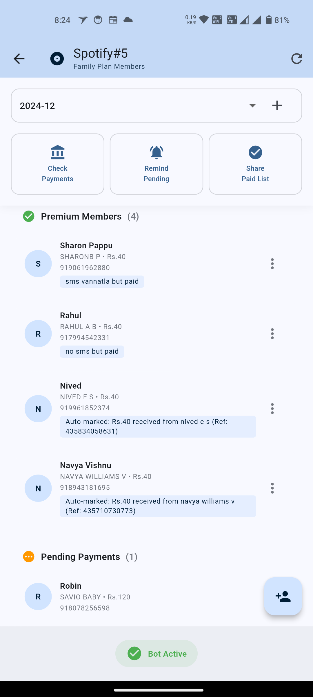
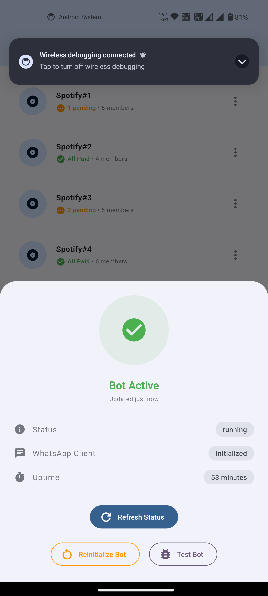

# 🎵 Spotifying - The Fun Way to Chase Your Spotify Money!

Ever felt like a debt collector trying to get your friends to pay their share of the Spotify Family Plan? Well, well, well... look who just found their new favorite app! 🕵️‍♂️

## 🎭 The Drama

You know the story:
1. You create a Spotify Family Plan
2. Your friends join in
3. They promise to pay monthly
4. *crickets chirping* 🦗

## 🦸‍♂️ Enter Spotifying!

This app is your new sidekick in the eternal quest of collecting Spotify payments. It's like having a personal assistant who's really, really passionate about getting your money back (without the awkward conversations).

## ✨ Features That'll Make Your Life Easier

### 🤖 WhatsApp Bot Integration
- Automatically detects payments from bank SMS
- Sends reminders to your forgetful friends (we all have them)
- Celebrates when someone actually pays! 🎉

### 👥 Family Plan Management
- Track multiple Spotify Family Plans
- Add/remove members faster than they can say "I'll pay you next week"
- See who's paid and who's trying to ghost you

### 💸 Payment Tracking
- Automatic payment detection from bank SMS
- Manual marking options (for those who pay in pizza 🍕)
- Monthly payment history that's clearer than your friends' excuses

### 🎨 Beautiful UI
- Modern Material Design
- Smooth animations
- Colors that won't hurt your eyes at 2 AM when you're checking who hasn't paid

## 📱 Screenshots

### Home Screen

### Group Details

### Bot Status

## 🛠️ Tech Stack

- Flutter for the sleek UI
- Firebase for storing all those "I'll pay tomorrow" promises
- WhatsApp Web.js for the bot that never sleeps
- Your friends' guilty consciences (results may vary)

## 🚀 Getting Started

1. Clone this repo
2. Run `flutter pub get` (get those dependencies like your friends should get their wallets)
3. Set up Firebase (because we need a place to store all the drama)
4. Configure the WhatsApp bot (it's like training a digital payment reminder ninja)
5. Run the app and watch the magic happen!

## 🤖 About the Bot

Our WhatsApp bot is like that friend who's really good at remembering who owes what:
- Built with wwebjs (WhatsApp Web JS)
- Reads bank SMS faster than your friends read payment reminders
- Sends notifications that are hard to ignore (but somehow they manage)
- Keeps track of who paid and who's "waiting for their salary"

## 🎯 Future Features

- [ ] Automatic eye-rolling when someone says "I'll pay you next month"
- [ ] AI-powered excuse detector
- [ ] Integration with your friends' calendar to block their Netflix time until they pay
- [ ] Quantum encryption for storing payment promises (they tend to quantum tunnel away)

## 🤝 Contributing

Found a bug? Have a feature idea? Want to add more passive-aggressive reminder messages? Contributions are welcome! Just:
1. Fork the repo
2. Create your feature branch
3. Commit your changes
4. Push to the branch
5. Open a PR and wait for your friends to review it (faster than they pay their Spotify share)

## 📜 License

This project is licensed under the "Please Just Pay Your Spotify Share" License - use it wisely!

## 🙏 Acknowledgments

- Thanks to all the friends who inspired this app by never paying on time
- Special thanks to WhatsApp for making group payment reminders less awkward
- Shoutout to Spotify for making family plans that we can all ~~fight over~~ share

---

Made with ❤️ and a lot of payment reminders
