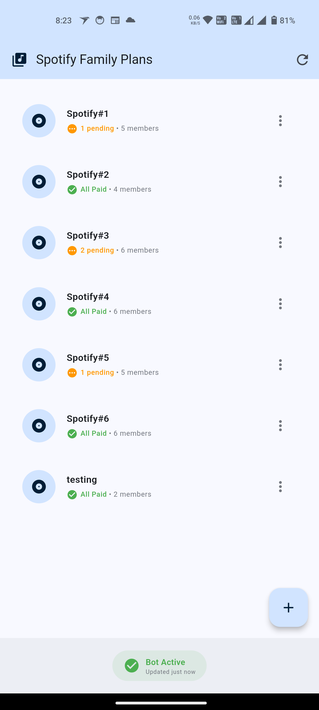
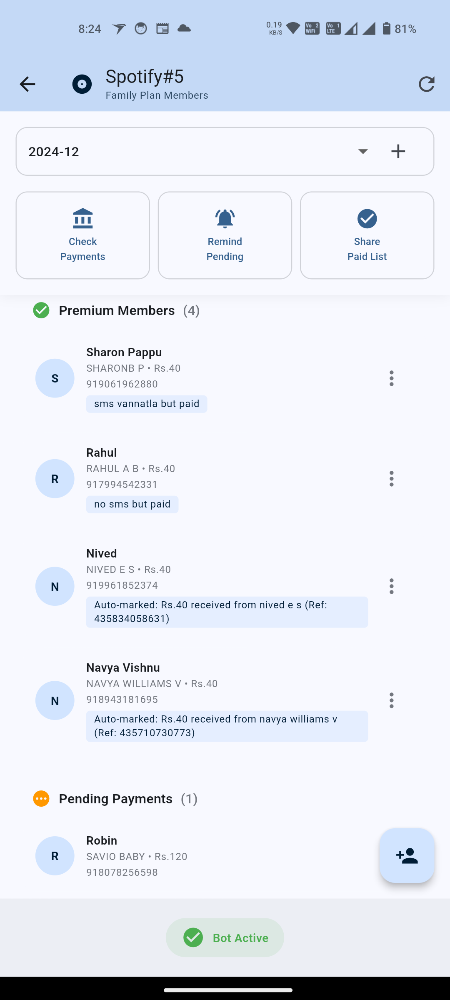
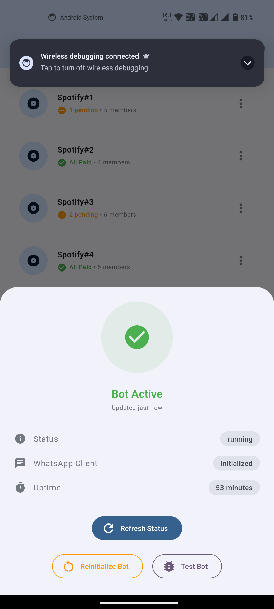

# 🎵 Spotifying - The Fun Way to Chase Your Spotify Money!

Ever felt like a debt collector trying to get your friends to pay their share of the Spotify Family Plan? Well, well, well... look who just found their new favorite app! 🕵️‍♂️

## 🎭 The Drama

You know the story:
1. You create a Spotify Family Plan
2. Your friends join in
3. They promise to pay monthly
4. *crickets chirping* 🦗

## 🦸‍♂️ Enter Spotifying!

This app is your new sidekick in the eternal quest of collecting Spotify payments. It's like having a personal assistant who's really, really passionate about getting your money back (without the awkward conversations).

## ✨ Features That'll Make Your Life Easier

### 🤖 WhatsApp Bot Integration
- Automatically detects payments from bank SMS
- Sends reminders to your forgetful friends (we all have them)
- Celebrates when someone actually pays! 🎉

### 👥 Family Plan Management
- Track multiple Spotify Family Plans
- Add/remove members faster than they can say "I'll pay you next week"
- See who's paid and who's trying to ghost you

### 💸 Payment Tracking
- Automatic payment detection from bank SMS
- Manual marking options (for those who pay in pizza 🍕)
- Monthly payment history that's clearer than your friends' excuses

### 🎨 Payment Automation
- Automatically detects bank transactions from SMS
- Matches payments using banking names
- Supports custom payment amounts per member
- Smart date detection (before/after 20th rule)
- Manual override with preset notes:
  - "SMS vannu but not detected"
  - "SMS vannila but paid"
  - "Verified by Gpay"
  - "CASH thannu"

### 🎨 Beautiful UI
- Modern Material Design
- Smooth animations
- Colors that won't hurt your eyes at 2 AM when you're checking who hasn't paid

## 📱 Screenshots

<table>
  <tr>
    <td width="33%">
      
      <p align="center">Home Screen</p>
    </td>
    <td width="33%">
      
      <p align="center">Group Details</p>
    </td>
    <td width="33%">
      
      <p align="center">Bot Status</p>
    </td>
  </tr>
</table>

## 🛠️ Tech Stack

- Flutter for the sleek UI
- Firebase for storing all those "I'll pay tomorrow" promises
- WhatsApp Web.js for the bot that never sleeps
- SMS Permission Handler for automatic payment detection
- Your friends' guilty consciences (results may vary)

## 🤖 About the Bot

Our WhatsApp bot is like that friend who's really good at remembering who owes what:
- Built with wwebjs (WhatsApp Web JS)
- Reads bank SMS faster than your friends read payment reminders
- Sends notifications that are hard to ignore (but somehow they manage)
- Keeps track of who paid and who's "waiting for their salary"

## 🎯 Future Features

- [ ] Automatic eye-rolling when someone says "I'll pay you next month"
- [ ] AI-powered excuse detector
- [ ] Integration with your friends' calendar to block their Netflix time until they pay
- [ ] Quantum encryption for storing payment promises (they tend to quantum tunnel away)

## 🤝 Contributing

Found a bug? Have a feature idea? Want to add more passive-aggressive reminder messages? Contributions are welcome! Just:
1. Fork the repo
2. Create your feature branch
3. Commit your changes
4. Push to the branch
5. Open a PR and wait for your friends to review it (faster than they pay their Spotify share)

## 📜 License

This project is licensed under the "Please Just Pay Your Spotify Share" License - use it wisely!

## 🙏 Acknowledgments

- Thanks to all the friends who inspired this app by never paying on time
- Special thanks to WhatsApp for making group payment reminders less awkward
- Shoutout to Spotify for making family plans that we can all ~~fight over~~ share

---

Made with ❤️ and a lot of payment reminders

# Spotified

A Flutter application for managing Spotify Family Plan payments among group members.

## Features

- Create multiple Spotify Family Plan groups
- Add members to each group
- Track payment status for each member on a monthly basis 
- Mark payments as paid or pending
- Clean, modern UI with light and dark themes

## Getting Started

### Prerequisites

- Flutter SDK (latest stable version)
- Firebase account for authentication and database
- Android Studio / VS Code / IntelliJ IDEA

### Installation

1. Clone the repository
```bash
git clone https://github.com/yourusername/spotified.git
```

2. Navigate to the project directory
```bash
cd spotified
```

3. Install dependencies
```bash
flutter pub get
```

4. Set up Firebase:
   - Create a new Firebase project
   - Add Android and iOS apps to your Firebase project
   - Download and add the configuration files (google-services.json for Android and GoogleService-Info.plist for iOS)
   - Enable Firebase Authentication and Firestore Database

5. Run the app
```bash
flutter run
```

## Project Structure

- `lib/core/constants/` - App-wide constants like colors and text styles
- `lib/core/models/` - Data models for the application
- `lib/core/providers/` - State management using Provider
- `lib/core/services/` - Firebase and other service classes
- `lib/ui/screens/` - UI screens for the application
- `lib/ui/widgets/` - Reusable UI components

## Dependencies

- [flutter](https://flutter.dev/) - UI toolkit for building natively compiled applications
- [provider](https://pub.dev/packages/provider) - State management
- [firebase_core](https://pub.dev/packages/firebase_core) - Firebase Core functionality
- [cloud_firestore](https://pub.dev/packages/cloud_firestore) - Firestore Database
- [shared_preferences](https://pub.dev/packages/shared_preferences) - Persistent storage for simple data
- [intl](https://pub.dev/packages/intl) - Internationalization and localization facilities
- [flutter_dotenv](https://pub.dev/packages/flutter_dotenv) - Environment variable management

## License

This project is licensed under the MIT License - see the LICENSE file for details.

## Acknowledgments

- Spotify for the design inspiration
- Flutter team for the amazing framework
